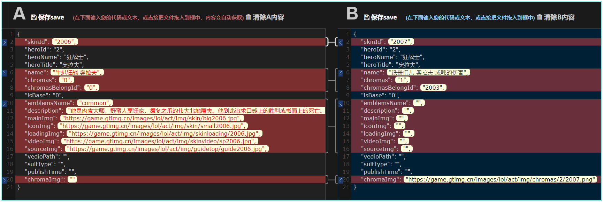

# Hero-Skin-LOL

## 王者荣耀

官网英雄介绍主页：<https://pvp.qq.com/web201605/herolist.shtml>，如果出英雄需要先下载该页面（放到脚本目录），然后执行脚本才有效。

爬取王者荣耀的英雄皮肤图片，详情请看对应python仓库：<https://github.com/yansheng836/hero-skin-images>。

游戏壁纸：<https://pvp.qq.com/web201605/wallpaper.shtml>

### 统计

到目前为止，王者荣耀一共有96个英雄，366个皮肤（含伴生皮肤）。

|         时间          | 英雄数量 | 皮肤数量 |
| :-------------------: | :------: | :------: |
|      2019-11-14       |    96    |   366    |
| 2021年1月30日23:41:04 |    96    |   422    |
| 2021年1月30日23:51:42 |   104    |   439    |

### 存在问题

爬取的网页数据不是最新的，如直接爬取最新的英雄为93，506，云中君；但是将该网页下载后再爬取，最新,96，523，西施。

处理方法：可以将网页先下载下来，爬取本地文件。

### bug

小图有一张有问题：

```
图片链接(https://game.gtimg.cn/images/yxzj/img201606/heroimg/142/142-bigskin-5.jpg)无效！响应状态码为：404
```

直接访问也是404。

### 辅助功能

统计英雄皮肤图片数量，拼接成json数据，为hexo博客提供每日切换背景图片的效果（现在有367张图片）。

主要程序：

- `DownloadBigskinWallpaper.java`：电脑壁纸，对应json：`wzry_mobile_367.json`
- `DownloadMobileskinWallpaper.java`：手机壁纸，对应json：`wzry_wallpaper367.json`

## 英雄联盟(LOL)

官网英雄介绍主页：<http://lol.qq.com/data/info-heros.shtml>

全部数据：<https://game.gtimg.cn/images/lol/act/img/js/heroList/hero_list.js>

单个英雄数据：`'//game.gtimg.cn/images/lol/act/img/js/hero/' + heroid + '.js'`

如：<http://game.gtimg.cn/images/lol/act/img/js/hero/1.js>

### 爬取数据

LOL主页（下面有英雄资料）：<https://lol.qq.com/main.shtml>

英雄主页：<https://lol.qq.com/data/info-heros.shtml>

具体英雄详情页面：<https://lol.qq.com/data/info-defail.shtml?id=1>

#### 皮肤图片大小

从https://game.gtimg.cn/images/lol/act/img/js/hero/1.js可以看到具体图片URL。


英雄小图（60*60）：<https://game.gtimg.cn/images/lol/act/img/skin/small1000.jpg>


英雄大图（980*500）：<https://game.gtimg.cn/images/lol/act/img/skin/big1000.jpg>


攻略中心图片<https://101.qq.com/detail.shtml?ADTAG=cooperation.glzx.web&name=Annie&line=mid>

：<https://game.gtimg.cn/images/lol/act/img/sourceImg/guide1000.jpg>


视屏封面图片：<https://game.gtimg.cn/images/lol/act/img/skinvideo/sp1000.jpg>


手机端：<https://game.gtimg.cn/images/lol/act/img/skinloading/1000.jpg>


#### 相关json

英雄列表json：<https://game.gtimg.cn/images/lol/act/img/js/heroList/hero_list.js?v=14>

具体英雄json：<https://game.gtimg.cn/images/lol/act/img/js/hero/1.js>

#### 主要图片尺寸！！

我主要是想爬取这三种尺寸的图片。

英雄小图（60*60）：<https://game.gtimg.cn/images/lol/act/img/skin/small1000.jpg>

英雄大图（980*500）：<https://game.gtimg.cn/images/lol/act/img/skin/big1000.jpg>

手机端：<https://game.gtimg.cn/images/lol/act/img/skinloading/1000.jpg>

### 统计

到目前为止，王者荣耀一共有96个英雄，366个皮肤（含伴生皮肤）。

|         时间          | 英雄数量 | 皮肤数量 | 实际下载皮肤数量 |
| :-------------------: | :------: | :------: | ---------------- |
| 2021年2月14日00:44:30 |   154    |   3545   | 1276             |
|                       |          |          |                  |


### 存在问题

部分英雄后面的几个皮肤的id和URL不一致，导致下载会出现问题，比如：第二个英雄 奥拉夫

<https://lol.qq.com/data/info-defail.shtml?id=2>

7 https://game.gtimg.cn/images/lol/act/img/skin/big2006.jpg

8 https://game.gtimg.cn/images/lol/act/img/skin/small2015.jpg

9 https://game.gtimg.cn/images/lol/act/img/skin/small2016.jpg

json对比



有效的皮肤的对应的皮肤json数据：

```json
{
    "skinId": "2006",
    "heroId": "2",
    "heroName": "狂战士",
    "heroTitle": "奥拉夫",
    "name": "牛扒狂战 奥拉夫",
    "chromas": "0",
    "chromasBelongId": "0",
    "isBase": "0",
    "emblemsName": "common",
    "description": "他是肉食大师，野蛮人烹饪家，凛冬之爪的伟大北地屠夫。他到此追求口感上的胜利或书面上的死亡。请给奥拉夫来点掌声！",
    "mainImg": "https://game.gtimg.cn/images/lol/act/img/skin/big2006.jpg",
    "iconImg": "https://game.gtimg.cn/images/lol/act/img/skin/small2006.jpg",
    "loadingImg": "https://game.gtimg.cn/images/lol/act/img/skinloading/2006.jpg",
    "videoImg": "https://game.gtimg.cn/images/lol/act/img/skinvideo/sp2006.jpg",
    "sourceImg": "https://game.gtimg.cn/images/lol/act/img/guidetop/guide2006.jpg",
    "vedioPath": "",
    "suitType": "",
    "publishTime": "",
    "chromaImg": ""
}
```

无效的：

```json
{
    "skinId": "2007",
    "heroId": "2",
    "heroName": "狂战士",
    "heroTitle": "奥拉夫",
    "name": "铁哥们儿 奥拉夫 成吨的伤害",
    "chromas": "1",
    "chromasBelongId": "2003",
    "isBase": "0",
    "emblemsName": "",
    "description": "",
    "mainImg": "",
    "iconImg": "",
    "loadingImg": "",
    "videoImg": "",
    "sourceImg": "",
    "vedioPath": "",
    "suitType": "",
    "publishTime": "",
    "chromaImg": "https://game.gtimg.cn/images/lol/act/img/chromas/2/2007.png"
}
```

### bug

小图有一张有问题：

```
图片链接(https://game.gtimg.cn/images/yxzj/img201606/heroimg/142/142-bigskin-5.jpg)无效！响应状态码为：404
```

直接访问也是404。